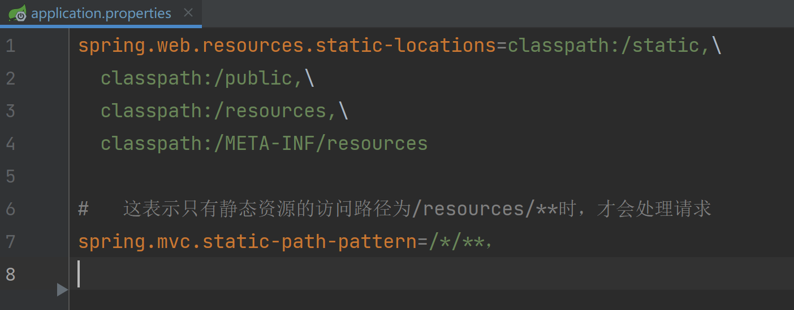
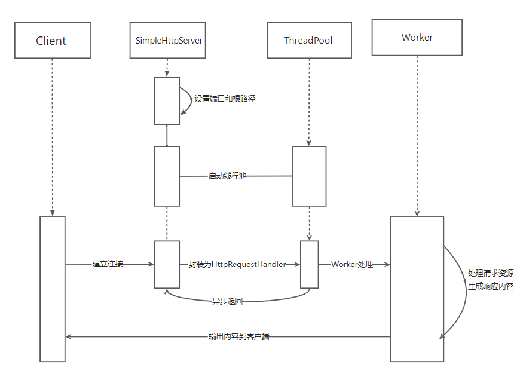
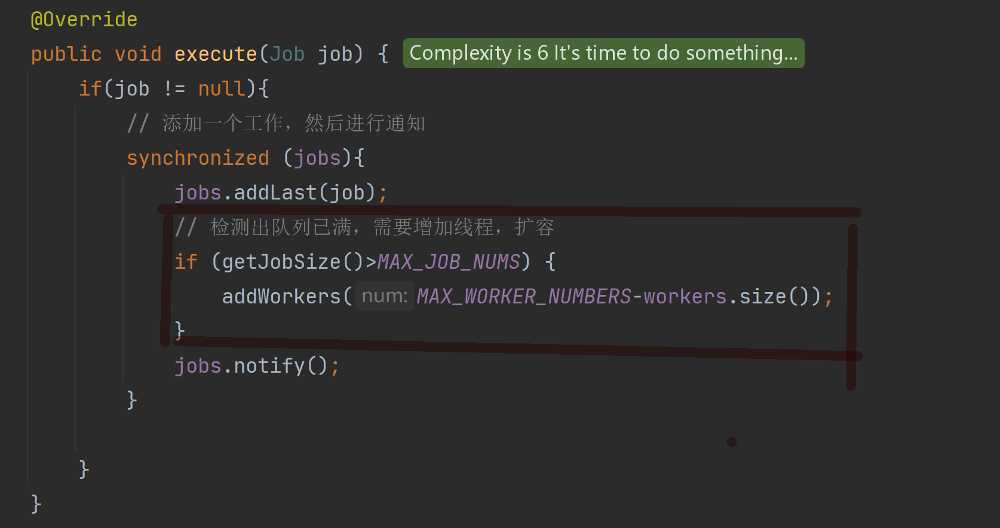
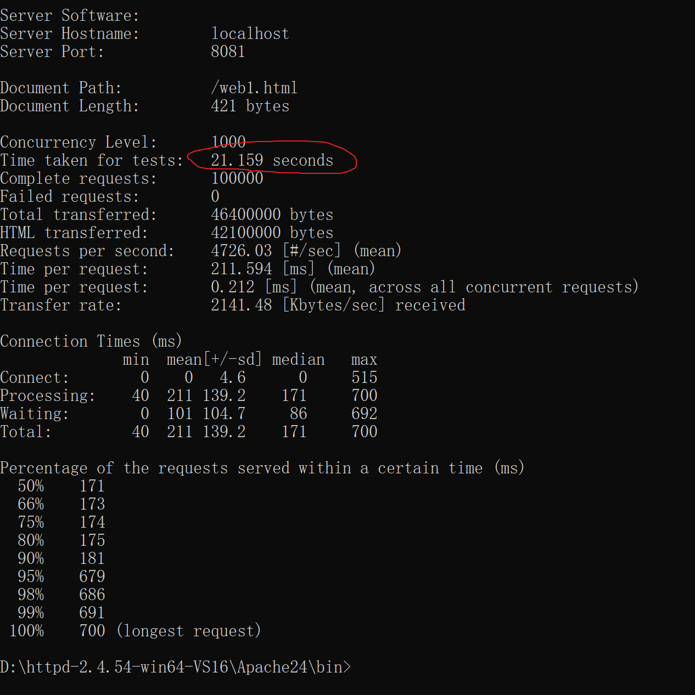
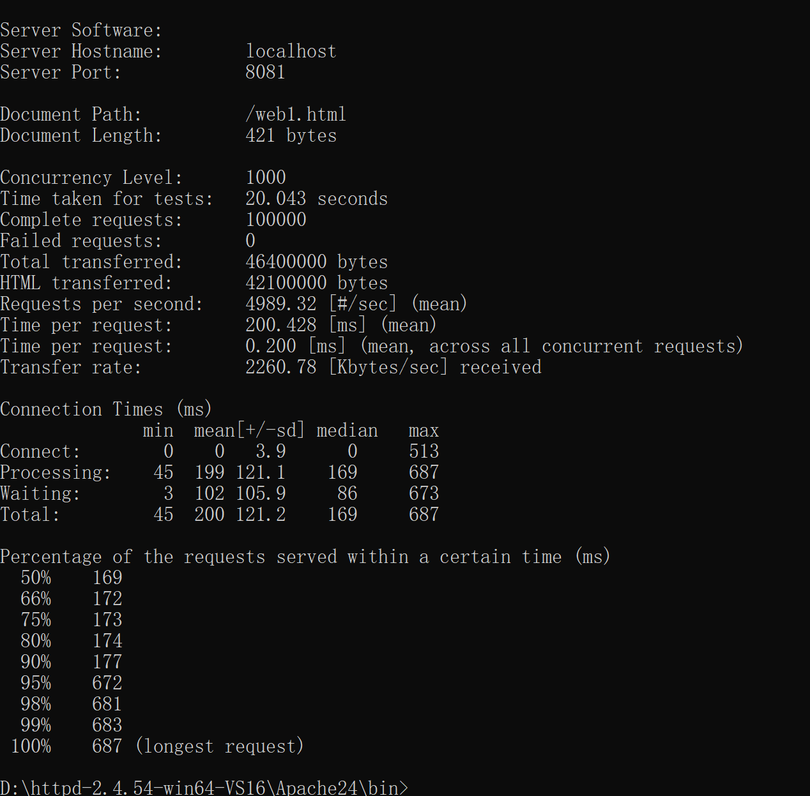

## 项目背景
本人目前大三，学校这学期开设了计算机网络这门课程。在学习应用层这章时，课后有一个实验“Web服务器”（《计算机网络自定向下》P119），基本上周围的同学都使用的是python实现，但是我觉得Java也可以实现。于是就写了这个项目。

[备用的项目文档](https://www.yuque.com/xsheng/gn6r2v/to4gm35oacga9d92?#%20%E3%80%8A%E9%A1%B9%E7%9B%AE%E8%AF%B4%E6%98%8E%E3%80%8B)

## 项目介绍
### 项目要求：
使用Java语言开发一个静态Web服务器，具体要求如下：

1. 当一个客户（浏览器）连接时创建一个连接套接字。
2. 从这个连接接收HTTP请求。
3. 解释该浏览器以确定所请求的特定文件。
4. 从服务器的文件系统获取请求的文件。
5. 创建一个由请求文件组成的HTTP报文，报文前面有首部行
6. 经过TCP连接向请求的浏览器发送响应，如果文件不存在服务器需要返回一个“404 Not Found”差错报文

### 项目配置
为了方便引入Jar包，使用了springboot配置环境

- 静态资源：	


- 配置指定指定资源位置



## 实现逻辑

1. 创建一个接收客户端请求的类SimpleHttpServer。设置监听端口为8081
2. 创建一个处理HTTP请求的静态类HttpRequestHandler，这个类需要实现Runnable接口用于实现多线程处理请求。
3. 创建一个处理线程池的接口 ThreadPool
4. 创建一个类DefaultThreadPool 实现 ThreadPool ，用来自定义线程实现方法
5. 在DefaultThreadPool 类中创建工作类 Worker，负责消费任务

### 系统流程：
SimpleHttpServer在建立了与客户端的连接之后，并不会处理客户端的请求，而是将其包装成HttpRequestHandler并交给线程池处理。在线程池中的Worker处理客户端请求的同时，SimpleHttpServer能够继续完成后续客户端连接的建立，不会阻塞后续客户端的请求。

### SimpleHttpServer
循环接收客户端请求
```java
// 启动SimpleHttpServer
public static void start() throws Exception {
    serverSocket = new ServerSocket(port);
    Socket socket = null;
    while ((socket = serverSocket.accept()) != null) {
        // 接收一个客户端的Socket，生成一个HttpRequestHandler， 放入线程池中执行
        threadPool.execute(new HttpRequestHandler(socket));
    }
    serverSocket.close();
}
```

### HttpRequestHandler
用于文件的发送
```java
InputStream in = null;
OutputStream out = null;
InputStream bis = null;

//接收客户端的请求
try {
    in = socket.getInputStream();
    byte[] bytes = new byte[1024];
    //一般来说1024个字节大小存肯定够了，但如果需要接收一长串的话可以 s += new String(bytes,0,len)
    int len = in.read(bytes);
    String header = new String(bytes, 0, len);
    // 由相对路径计算出绝对路径
    String filePath = basePath + header.split(" ")[1];

    File file = new File(filePath);


    //根据请求内容向客户端返回相应的文件
    out = socket.getOutputStream();

    // 如果资源不存在，返回404 Not Found
    if ( !file.exists()) {
        out.write("HTTP/1.1 404 Not Found".getBytes());
        out.write("Server: Molly".getBytes());
        out.write("".getBytes());
    } else {
        bis = new FileInputStream(file);
        out.write("HTTP/1.1 200 OK\r\n".getBytes());
        out.write("Content-Type:text/html\r\n".getBytes());
        out.write("\r\n".getBytes());
        byte[] buffer=new byte[1024];
        len=-1;
        while ((len = bis.read(buffer)) != -1) {
            out.write(buffer,0,len);
        }

    }

} catch (Exception ex) {
    ex.printStackTrace();
} finally {
    close(socket,out,in,bis);
}
```

### DefaultThreadPool

默认创建5个线程数，当数据量过大即工作队列jobs的大小超过MAX_JOB_NUMS时，自动添加新的线程，最大线程数为MAX_WORKER_NUMBERS

```java
    // 线程池的最大数量
    private static final int MAX_WORKER_NUMBERS = 10;

    // 线程池默认的数量
    private static final int DEDAULT_WORKER_NUMBERS = 5;

    // 线程池最小的数量
    private static final int MIN_WORKER_NUMBERS = 1;

    // 工作队列，将会向队列中加入工作
    private final LinkedList<Job> jobs = new LinkedList<>();

    // 工作队列的最大数量
    private static final int MAX_JOB_NUMS = 10;

    // 工作者列表
    private final List<Worker> workers = Collections.synchronizedList(new ArrayList<Worker>());

    // 工作者线程的数量
    private int workerNum = DEDAULT_WORKER_NUMBERS;

    // 线程编号生成
    private final AtomicLong threadNum = new AtomicLong();
```

### Worker
```java
 // 工作者 负责消费任务
    class Worker implements Runnable{

        // 是否工作
        private volatile boolean running = true;

        @Override
        public void run(){
            while(running){
                Job job = null;
                synchronized (jobs){
                    // 如果工作者列表是空的 ，那么就wait 等待被唤醒
                    while (jobs.isEmpty()) {
                        try{
                            jobs.wait();
                        }catch (InterruptedException exception){
                            // 感知到外界对WorkerThread的中断操作，返回
                            Thread.currentThread().interrupt();
                            return;
                        }

                    }
                    // 取出一个Job
                    job = jobs.removeFirst();
                }
                if (job!=null) {
                    try{
                        job.run();
                    }catch (Exception ex){
                        ex.printStackTrace();
                    }
                }

            }

        }

        // 停止消费
        public void shutdown(){
            running = false;
        }
    }
```

## 测试结果

- 请求resource/static下的web3.html，内面包含了一个视频和一段文字


- 使用Apache24做了一下压力测试，毕竟使用了多线程

       _ab -c 1000 -n 100000 http://localhost:8081/web1.html        _
该命令主要含义是每秒发送1000个请求，总共返送100000个请求

   1. 第一种情况 如果系统一直保持5个线程执行，也就是注释掉DefaultThreadPool下的这段代码
   
      测试结果总共需要21,159秒
      
   
      
   
   2.  第二种情况，使用扩容机制，时间为20.043秒


## 结语
这个项目虽然符合任务要求，但仍然存在一些问题，比如直接请求图片资源会出现乱码，但是请求html文件或者txt文本是没有问题。项目用了一个晚上实现，自己收获很多，尤其是对于多线程这方面的操作，以前只停留在理论层次，这次算是对之前学到的知识进行应用。至于改进的地方，我认为有两点

1. 请求图片或视频乱码。
2. 虽然我使用了多线程，但是对于大文件的上传我并没有坐任何优化处理，比如一个客户端请求了一个html文件，这个html文件需要3个csv文件，我就需要再去处理这3个csv文件，效率比较低。

针对第一点我认为可能是浏览器不适配，毕竟我在html文件中放入视频后，再去请求这个html就能成功，那就说明我的代码逻辑是没问题。对于第二点，我认为可以使用CountDownLatch来处理多个文件，最后再合并发送给客户端。
